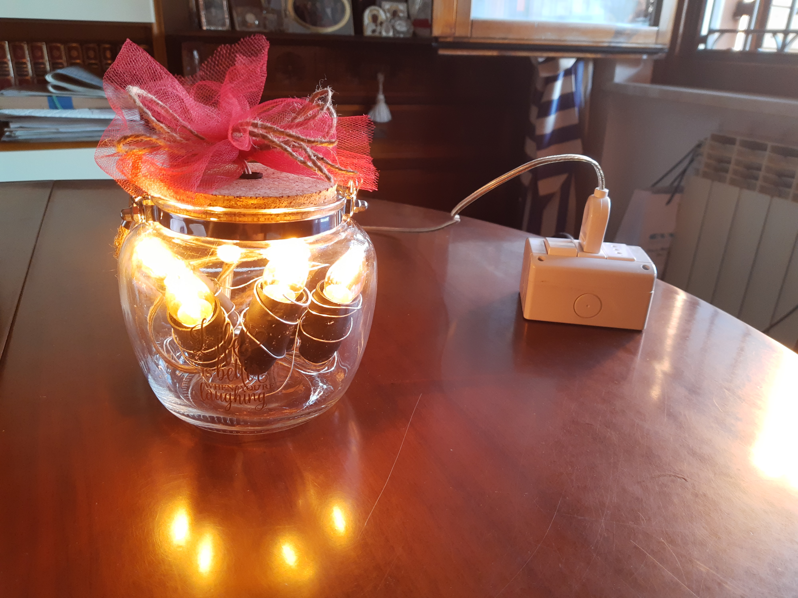
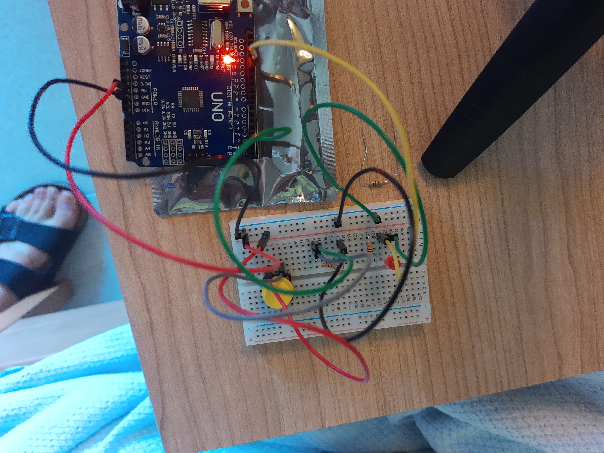
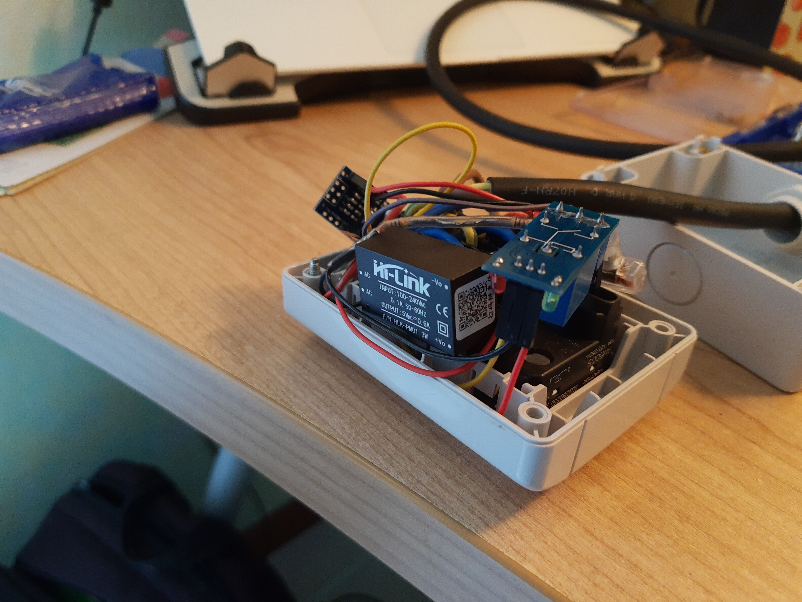
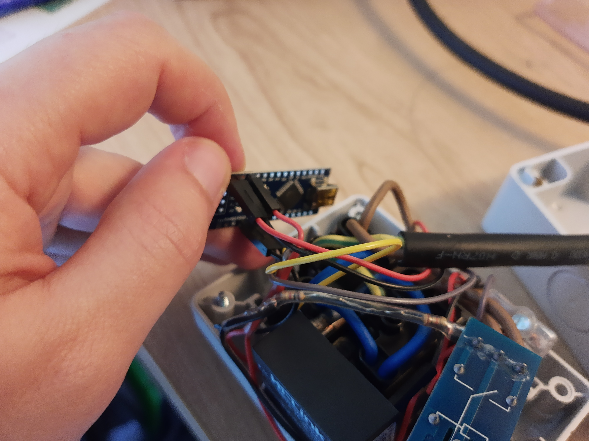
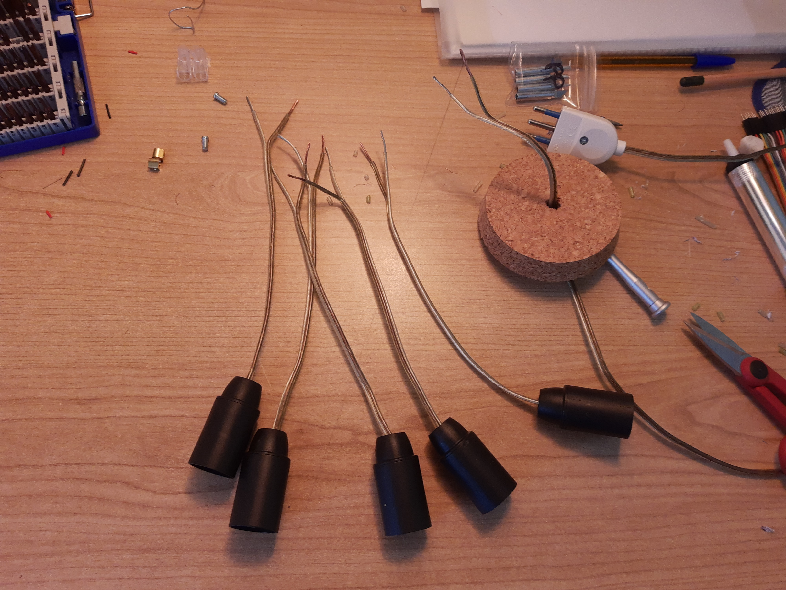
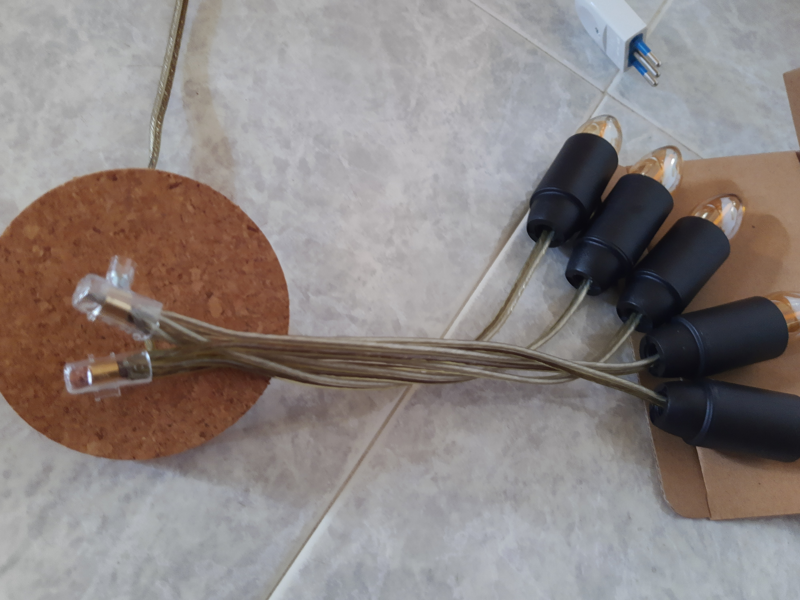
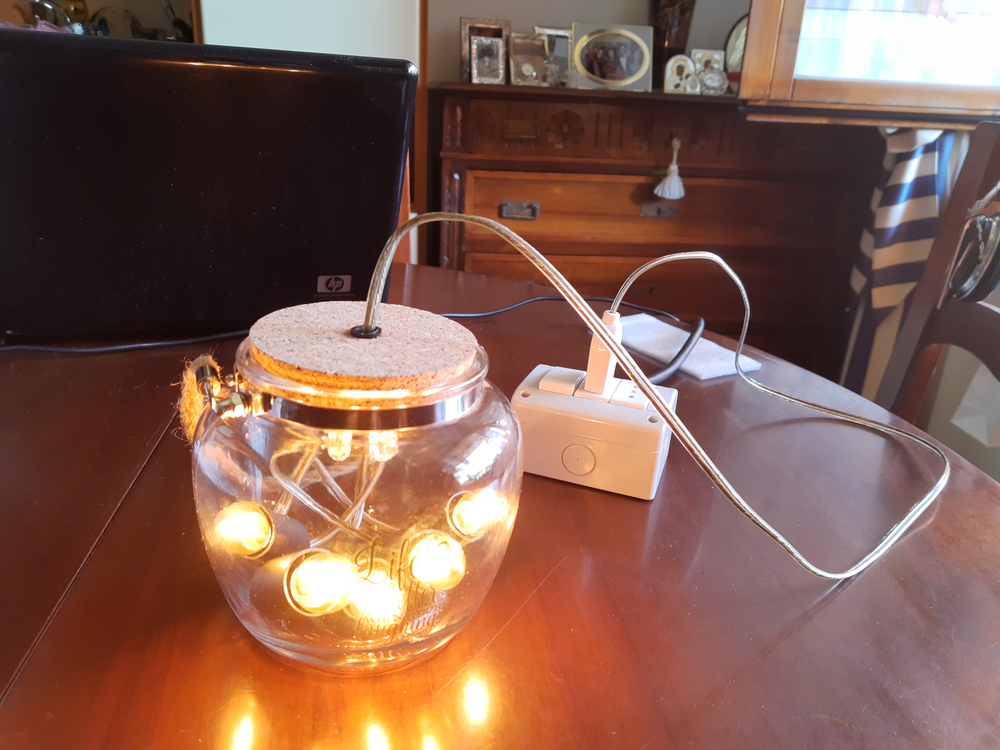

# DreamingLight
System for providing a light that could be turned on by a button and then it turns off automatically after a predefined time (or by pressing the same button).  
Useful for the people are afraid about the night dark and need a low light to fall asleep but then would like to dream well with no light.  

  

*Warning!  
It's used high voltage for this project.  
Don't try to reproduce this project if you don't know what you are doing.*  

## Used technologies
* *Arduino UNO* with a breadboard, a led and a button for tests;  
* *Arduino micro* for the final implementation;  
* *5V Relay* controlled by the Arduino for switch on or off the high voltage;  
* various cables and electrical things for the box and the button;  
* a soldering iron.  

  

  

